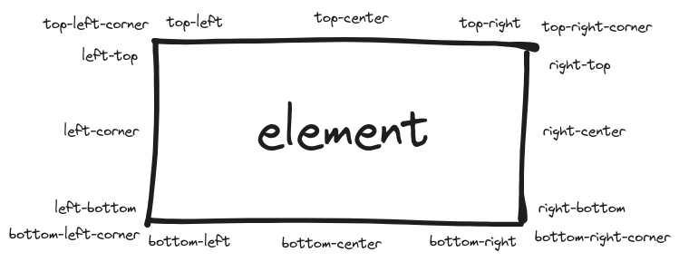

<p>
  
</p>

# solid-js-tooltip

[](https://pnpm.io/)

Description


## Quick start

### Installation:

```bash
npm i solid-js-tooltip
# or
yarn solid-js-tooltip
# or
pnpm add solid-js-tooltip
```

### [Demo here!](111)

---

### Usage:

```ts
import { type TooltipDirective, tooltip } from 'solid-js-tooltip';
import 'solid-js-tooltip/styles.css';

// https://github.com/solidjs/solid/discussions/845
tooltip;

declare module 'solid-js' {
  namespace JSX {
    interface Directives extends TooltipDirective {}
  }
}
```

### Examples:

```tsx
<p
  class="highlight-text"
  use:tooltip={{
    tooltips: [
      {
        element: <div class="tooltip">Is this lorem?</div>,
      },
    ],
  }}
  tabIndex={0}
>
  Maecenas blandit arcu eget rutrum sodales. Vestibulum tempor mi nec metus
  elementum fermentum. Aenean a gravida justo, nec pharetra massa.
</p>
```

```tsx
<p
  class="highlight-text"
  use:tooltip={{
    tooltips: [
      {
        element: <div class="tooltip">What...</div>,
        position: 'top-center',
      },
      {
        element: <div class="tooltip">is ... this...</div>,
        position: 'right-center',
      },
    ],
  }}
  tabIndex={0}
>
  Etiam dictum eleifend justo, sit amet porttitor lectus ullamcorper eget. Morbi
  aliquet, nibh non porta euismod, metus est tincidunt ex, id vehicula massa
  metus id arcu. Nunc quis tincidunt metus, eu dapibus ligula.
</p>
```

```tsx
<p
  class="highlight-text"
  use:tooltip={{
    tooltips: [
      {
        element: <div class="tooltip">Hey! I am describing something...</div>,
        displayOnHover: false,
      },
    ],
    onFocusin: (event) => {
      console.log('"focusin" event:"', event);
    },
  }}
  tabIndex={0}
>
  Maecenas blandit arcu eget rutrum sodales. Vestibulum tempor mi nec metus
  elementum fermentum. Aenean a gravida justo, nec pharetra massa.
</p>
```
